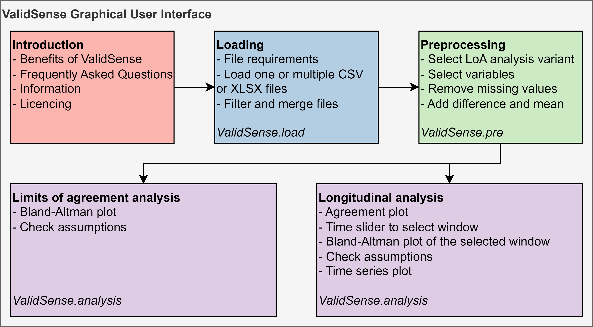

# ValidSense

## Description
The ValidSense toolbox aims to assess the agreement between two quantitative methods or devices measuring the same quantity 
using the Limits of Agreement analysis (LoA analysis), also known as the Bland-Altman analysis, using four existing variants. 
Moreover, a Longitudinal analysis is developed to assess agreement over time.

## Requirements
- Anaconda (you may install Anaconda by downloading the installer from https://www.anaconda.com/download and running it on your computer).
- Python version 3.13.2 is assumed to be available in the installation process. The Python package versions in the requirements.txt file have been tested to work for Python 3.12 as well. If these are not available in your environment, and you run into problems when using a different Python version, you might try to install after removing the versions from the requirements.txt file. 

## Installation process
To run ValidSense: 
- [Clone](https://docs.github.com/en/repositories/creating-and-managing-repositories/cloning-a-repository) or [download](https://docs.github.com/en/get-started/start-your-journey/downloading-files-from-github) and unzip the ValidSense repository to your computer 
- Open the Anaconda prompt on Windows, or your built-in command line application on Mac or Linux
- change to the cloned or downloaded ValidSense folder, where the requirement.txt and 📄_Introduction.py files are (fill in the folder name in \<ValidSense folder\>)  
  `cd <ValidSense folder>`
- You probably want to create a separate environment for ValidSense (fill in a name for your environment in \<ENV-NAME\>):   
  `conda create --name <ENV-NAME>`  
  `conda activate <ENV-NAME>`
- Install required software and versions  
  `conda install python==3.13.2`  
  `pip install -r requirements.txt`
- Start ValidSense, this opens a webpage in your browser for the ValidSense application  
  `streamlit run 📄_Introduction.py`

## Configuration
No additional configuration is required. However, if you will run the app on a server and share it with others, you may want to add custom information, for example to tell users how to contact you for support. You can create a "custom_information.txt" file in the root folder of the package with your information. This information is then displayed at the bottom of the Introduction page under the Information header. The text in the file is processed as Markdown text. 

## Usage
ValidSense is a webbased application, consisting of five pages, shown in the figure below. Follow the instructions on these pages sequentially. 
Before the LoA analysis or the longitudinal analysis can be performed, the loading and preprocessing pages must be followed sequentially.
Detailed instructions are given in the web interface. This is a summary of the usage of the five pages. 
1. Introduction: Information about the ValidSense software and the statistical methods is given here
2. Loading: Files must be uploaded here, and some filtering settings can be made. Use CSV or XLSX files
3. Preprocessing: The analysis variant is chosen, as well as variables and settings. Variants available:
   - Limits of Agreement: 
     - Classic: Assess agreement in single pair of measurements per patient, [Bland & Altman 1986](https://pubmed.ncbi.nlm.nih.gov/2868172/)
     - Repeated measurements: Assess agreement in multiple measurements per patient, 
	   [Bland & Altman 1999 section 5.2](https://pubmed.ncbi.nlm.nih.gov/10501650/), [Bland & Altman 2007 section 3](https://pubmed.ncbi.nlm.nih.gov/17613642/) 
     - Mixed-effects: Assess agreement based on the mixed-effects LoA analysis, allowing to correct, for example, 
	   multiple measurements per patient or systematic relationship between the difference and mean, [Parker et al. 2016](https://pubmed.ncbi.nlm.nih.gov/27973556/)
     - Regression of difference: Assess agreement in a single measurement per patient, with a linear relationship between difference and mean for bias 
	   and/or LoA, [Bland & Altman 1999 section 3.2](https://pubmed.ncbi.nlm.nih.gov/10501650/)
   - Longitudinal analysis: a new method to assess agreement over time.
5. Limits of Agreement Analysis: The Bland-Altman plot is shown, along with information helping to check assumptions of the analysis
6. Longitudinal Analysis: The newly developed Longitudinal analysis can assess non-constant agreement over time.
   The longitudinal analysis involves breaking down a dataset into smaller parts over time and applying existing LoA analysis to each part.
   A moving time window is applied, and based on the data included in the window, the bias and 95% LoA are calculated for each time window.
   The agreement plot graphical visualises the results of the longitudinal analysis. A window can be selected using the time slider, 
   shown in the Bland-Altman plot of a selected window, and allows the user to navigate through the time domain.
   In addition traditional Time series plots are also available (independent from the Longitudinal analysis), 
   to show the datapoints and trendlines of each cluster.

More information is on the Introduction page within the app. You may find a preview of the content of the Introduction page here: 
[ValidSense_Introduction.pfd](ValidSense_Introduction.pdf)
   

## Contribution
This repo is offered as is. Unfortunately, no technical support for maintenance or new features is planned for. If you have ideas for improvement, 
please fork the repo and create your own version. For conceptual consultation about improvements, you are very welcome to contact 
Teus Kappen, who is a clinical epidemiologist and initiator of this repo: T.Kappen@umcutrecht.nl 

## Acknowledgement
This software was developed by Peter van 't Ooster as part of his Master Thesis project for the Technical Medicine MSc programme, 
a cooperation between University of Twente and UMC Utrecht: 
[Validation of Vital Sign Monitoring Devices - University of Twente Student Theses](https://essay.utwente.nl/94905/)  

## Citation
@software{van_t_Ooster_ValidSense_2023,
author = {van 't Ooster, Peter},
month = may,
title = {{ValidSense}},
url = {https://github.com/petervtooster/ValidSense},
version = {1.0},
year = {2023}
}

## License
MIT License

Copyright 2022 Peter van 't Ooster

Permission is hereby granted, free of charge, to any person obtaining a copy of this software and associated documentation files (the “Software”), 
to deal in the Software without restriction, including without limitation the rights to 
use, copy, modify, merge, publish, distribute, sublicense, and/or sell copies of the Software, 
and to permit persons to whom the Software is furnished to do so, subject to the following conditions:

The above copyright notice and this permission notice shall be included in all copies or substantial portions of the Software.

THE SOFTWARE IS PROVIDED “AS IS”, WITHOUT WARRANTY OF ANY KIND, EXPRESS OR IMPLIED, INCLUDING BUT NOT LIMITED TO THE WARRANTIES OF MERCHANTABILITY, 
FITNESS FOR A PARTICULAR PURPOSE AND NONINFRINGEMENT. 
IN NO EVENT SHALL THE AUTHORS OR COPYRIGHT HOLDERS BE LIABLE FOR ANY CLAIM, DAMAGES OR OTHER LIABILITY, 
WHETHER IN AN ACTION OF CONTRACT, TORT OR OTHERWISE, ARISING FROM, OUT OF OR IN CONNECTION WITH THE SOFTWARE OR THE USE OR OTHER DEALINGS IN THE SOFTWARE.

